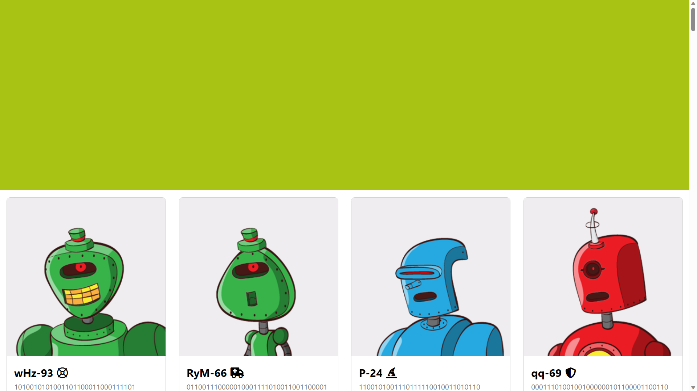
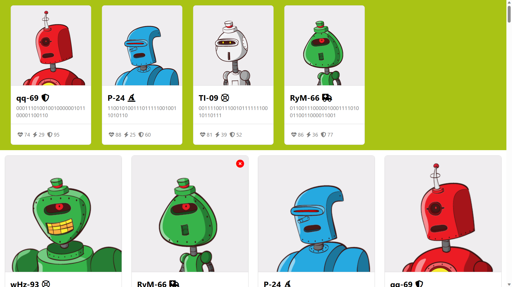

# PHASE 2 - WEEK 2 - CODE CHALLENGE

# Bot Battlr

A website demo of components, props, state, events, and data fetching in react.

A galactic overlord has hired you to build a galactic web app that will allow them to browse through a list of robots, view a robot's details, and, enlist a bot into their army. Actions available:

- See profiles of all bots rendered in `BotCollection`.
- Add an individual bot to my army by clicking on it. The selected bot should
 render in the `YourBotArmy` component. The bot can be enlisted only **once**.
The bot **does not** disappear from the `BotCollection`.
- Release a bot from my army by clicking on it. The bot disappears from the
 `YourBotArmy` component.
- Discharge a bot from their service forever, by clicking the red button marked
 "x", which would delete the bot both from the backend and from the
 `YourBotArmy` on the frontend.

# Setup Requirements

- Visual Studio Code, details [here](https://code.visualstudio.com/)
- Windows Subsystem for Linux (WSL), details [here](https://learn.microsoft.com/en-us/windows/wsl/install)
- Git and Github
- Node.js (includes npm), details [here](https://nodejs.org/en)
- json-server, details [here](https://www.npmjs.com/package/json-server)
- Deployment uses Github Pages, details [here](https://docs.github.com/en/pages/quickstart), view deployment using this [link](https://eugenemrg.github.io/Bot-Battlr/) 
- Published using [gh-pages](https://www.npmjs.com/package/gh-pages)
- Use any modern web browser

# Installation

- Clone/Download the code from GitHub repository
- Navigate to the project directory
- Run npm install
- Run npm start to run the app on the browse
- The app should run on any modern web browser with JavaScript enabled

# Technologies

Technologies used in the project include:

- JavaScript
- JSX
- HTML
- CSS
- JSON
- json-server mock API using included db.json

# Screenshots

See profiles of all bots rendered in BotCollection

Add an individual bot to my army by clicking on it. The selected bot should render in the YourBotArmy component. The bot can be enlisted only once. The bot does not disappear from the BotCollection.
Release a bot from my army by clicking on it. The bot disappears from the YourBotArmy component.

Discharge a bot from their service forever, by clicking the red button marked "x"

# Author

[Eugene Aduogo](https://github.com/eugenemrg)

# License

Bot Battlr. A website demo of components, props, state, events, and data fetching in react.

Copyright (C) 2023  [Eugene Aduogo](https://github.com/eugenemrg)

Licensed under GNUv3. See [license](/LICENSE)

This program is free software: you can redistribute it and/or modify
it under the terms of the GNU General Public License as published by
the Free Software Foundation, either version 3 of the License, or
(at your option) any later version.

This program is distributed in the hope that it will be useful,
but WITHOUT ANY WARRANTY; without even the implied warranty of
MERCHANTABILITY or FITNESS FOR A PARTICULAR PURPOSE.  See the
GNU General Public License for more details.

You should have received a copy of the GNU General Public License
along with this program.  If not, see <https://www.gnu.org/licenses/>.
